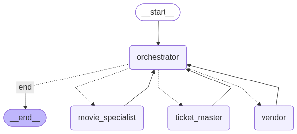

# Multi‑Agent Movie Theater System

## How to run it
First, `cd` to this folder.
### Prerequisite:
- Edit `.env.example` file, add your `OPENAI_API_KEY`, and rename the file to `.env`
- Download TMDB 5000 Movie Datasets, and put them in `./data` folder. Only the first 100 rows are used in code.
```
data
├── tmdb_5000_credits.csv
├── tmdb_5000_movies.csv
└── vendor.json
```

### Run with docker (easiest)

```
docker pull haoweihaowei/acto:latest

docker run -it --rm \
    -v $(pwd)/.env:/app/.env \
    -v $(pwd)/data:/app/data \
    haoweihaowei/acto:latest
```

### Run with python

Python 3.10 is recommended to use. You can use `uv` to create a virtual environment.
```
 uv python pin 3.10
 uv init
 uv venv
 uv add -r requirements.txt
 source .venv/bin/activate
 python main.py
```
## Demo
1. Orchestrator: cross-domain query -> partially answered, asked for further clarification about movie name
2. Orchestrator: give movie name -> answered correctly
3. Switch to ticket agent: ask about showtime -> answered correctly
4. Switch back to orchestrator: What snack did I order? -> orchestrator still remembered it
5. Switch to movie agent about a cross-domain query -> escalated to orchestrator


## Architecture

### Orchestrator agent


### Movie agent:
- recommend_movies tool
- get_movie_details tool
- get_actor_info tool

### Ticket agent:
- check_showtimes tool
- get_pricing tool
- purchase_tickets tool

### Vendor agent:
- get_snack_pricing tool
- check_availability tool
- place_order tool
